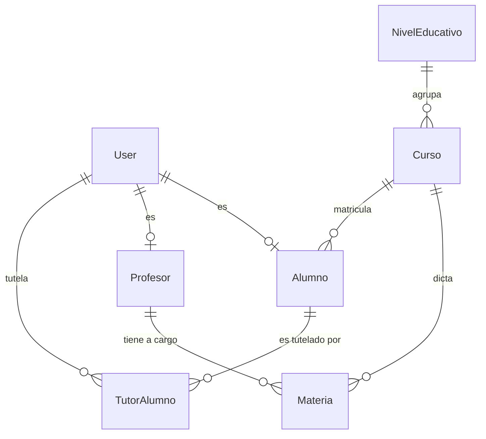
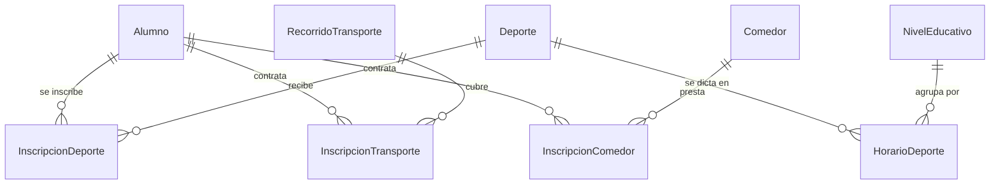
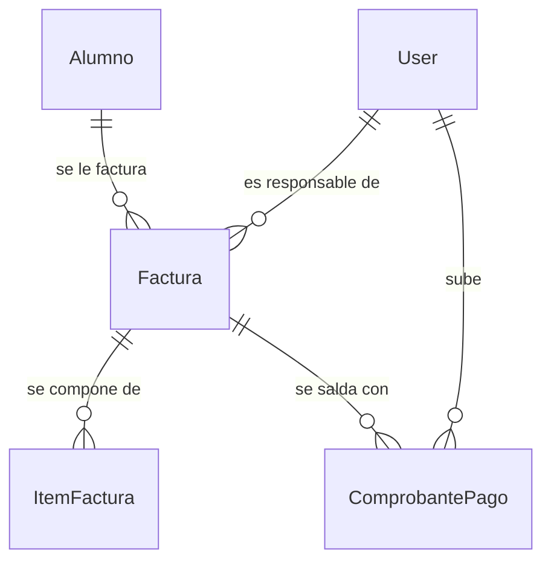
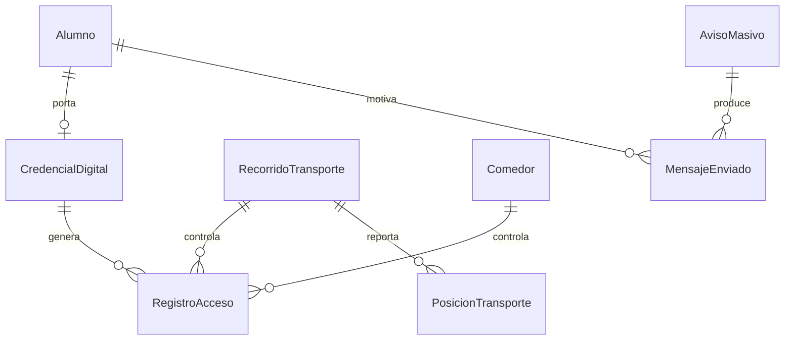

# Sistema Integral de Gestión — Centro Educativo "Transformar para Educar"

**Trabajo Práctico Integrador — Metodología de Sistemas II**
Tecnicatura Universitaria en Programación (TUP) · 2026
**Equipo Naft:** Nahuel Alem · Fabricio Ceniquel Thompson
**Institución:** Resistencia, Chaco · Inicio de actividades previsto: marzo de 2027

Sistema de tres aplicaciones —portal web institucional, backoffice de gestión y
aplicación móvil para tutores— que comparten **un único backend y una única base
de datos**.

---

## Índice

1. [El problema](#1-el-problema)
2. [Cumplimiento de la consigna](#2-cumplimiento-de-la-consigna)
3. [Stack tecnológico](#3-stack-tecnológico)
4. [Arquitectura](#4-arquitectura)
5. [Estructura del repositorio](#5-estructura-del-repositorio)
6. [Base de datos](#6-base-de-datos)
7. [API REST](#7-api-rest)
8. [Aplicación móvil](#8-aplicación-móvil)
9. [Puesta en marcha](#9-puesta-en-marcha)
10. [Pruebas](#10-pruebas)
11. [Documentación](#11-documentación)
12. [Convenciones de trabajo](#12-convenciones-de-trabajo)

---

## 1. El problema

La Dirección lleva la información dispersa entre planillas y papel. De ahí se
desprenden cuatro problemas concretos que el sistema resuelve:

| Problema | Cómo se resuelve |
|---|---|
| Alumnos cargados dos veces, con legajos distintos | DNI único en el motor y legajo autogenerado |
| Inscripciones a deportes que se superponen en horario, detectadas tarde | El motor rechaza el cruce en el momento de inscribir |
| Cobranza manual: no se sabe quién debe qué | Facturación con ítems discriminados y estado derivado de los pagos |
| La familia no sabe si el chico subió al micro o entró al comedor | Carnet digital con QR y aviso inmediato |

---

## 2. Cumplimiento de la consigna

### 2.1 Componentes exigidos

| Componente | Estado | Dónde |
|---|---|---|
| **Página web institucional** — quiénes somos, niveles, bienestar, noticias, inscripción, empleo, galería | ✅ | [`web/frontend/index.html`](web/frontend/index.html) |
| Reseñas públicas sin login | ✅ | `OpinionPublica` · `GET /api/public/opinions` |
| Portal de login unificado (4 roles) | ✅ | [`web/frontend/js/`](web/frontend/js/) |
| **Backoffice** — módulo Alumnos | ✅ | [`modules/alumnos/`](web/backend/src/modules/alumnos/) · [`panel_admin.html`](web/frontend/panel_admin.html) |
| **Backoffice** — módulo Profesores | ✅ | [`modules/profesores/`](web/backend/src/modules/profesores/) |
| **Backoffice** — módulo Administrador (ABM, roles, reportes) | ✅ | [`modules/administrador/`](web/backend/src/modules/administrador/) · [`modules/reportes/`](web/backend/src/modules/reportes/) |
| **Manual de usuario** — por rol, con el alta de alumno paso a paso | ✅ | [`docs/manual_de_usuario.md`](docs/manual_de_usuario.md) |
| **Recuperación de contraseña** — correo con enlace de un solo uso | ✅ | [`restablecer.html`](web/frontend/restablecer.html) · [`modules/auth/`](web/backend/src/modules/auth/) |
| **Backoffice** — cola de comprobantes y tareas programadas | ✅ | [`admin-comprobantes.js`](web/frontend/js/vistas/admin-comprobantes.js) · [`admin-tareas.js`](web/frontend/js/vistas/admin-tareas.js) |
| **Política de datos personales** (RNF-09, Ley 25.326) | ✅ | [`docs/politica_de_datos.md`](docs/politica_de_datos.md) |
| **Purga de retención** — diaria, en modo informe hasta confirmar plazos | ✅ | [`shared/retencion.ts`](web/backend/src/modules/shared/retencion.ts) |
| **App móvil** — autenticación segura y RBAC | ✅ | [`mobile/src/auth/`](mobile/src/auth/) |
| **App móvil** — cuotas, vencimientos e historial | ✅ | [`mobile/src/pantallas/Finanzas.tsx`](mobile/src/pantallas/Finanzas.tsx) |
| **App móvil** — pago por transferencia, 1 o más comprobantes | ✅ | [`PagoTransferencia.tsx`](mobile/src/pantallas/PagoTransferencia.tsx) |
| **App móvil** — deuda discriminada por ítem | ✅ | `ItemFactura.tipo` ∈ {cuota, transporte, comedor, deporte} |
| **Scheduler** — último día hábil: resumen + factura adjunta | ✅ | [`modules/scheduler/jobs.ts`](web/backend/src/modules/scheduler/jobs.ts) |
| **Scheduler** — día 20: recordatorio de deuda | ✅ | idem |
| **Desafío de valor agregado** | ✅ | Carnet digital con QR dinámico |

### 2.2 Requerimientos funcionales

| RF | Requerimiento | Cómo se hace cumplir |
|---|---|---|
| **RF-01** | Alta de alumnos sin duplicados | `Alumno.dni` único, legajo autogenerado, `cursoId` obligatorio |
| **RF-02** | Máximo 2 deportes, sin cruce de horarios | Índice único parcial + 2 disparadores en PL/pgSQL |
| **RF-03** | Padres solo ven a sus propios hijos | Tabla `TutorAlumno` + matriz de autorización |
| **RF-04** | Materias y cursos por docente | Módulo `profesores/` |
| **RF-05** | Inscripción a uno de 4 recorridos | Enum `CodigoRecorrido` + disparador que impide el borrado |
| **RF-06** | Listado de alumnos por materia | `GET /api/reportes/alumnos-por-materia` |
| **RF-07** | API de mensajería para avisos | Patrón *Strategy* con proveedor intercambiable |
| **RF-08** | Geolocalización del transporte | `PosicionTransporte` + estado derivado del rastreo |

### 2.3 Reglas de negocio críticas

Las reglas **se hacen cumplir en el motor de base de datos**, no solo en los
servicios. Una regla escrita únicamente en código se elude con una consulta
directa, una carga masiva o un error en un camino alternativo; una restricción
del motor no.

| Regla | Mecanismo |
|---|---|
| Un alumno pertenece a un único curso; un curso a un único nivel | FK obligatorias |
| Máximo 2 deportes simultáneos | Índice único parcial sobre `(alumnoId, slot) WHERE estado = 'ACTIVA'` |
| Sin conflictos de horario entre deportes | `trg_inscripcion_deporte_sin_solapamiento` |
| Exactamente 4 recorridos de transporte | `trg_recorrido_no_eliminar` + enum `CodigoRecorrido` |
| Los padres solo gestionan a sus hijos | `TutorAlumno` + `trg_tutor_alumno_valida_rol` |
| Solo transferencias, nunca efectivo | `trg_comprobante_validar` exige archivo adjunto |
| Una factura, varios comprobantes (1:N) | `trg_comprobante_recalcula_factura` deriva el estado |

### 2.4 Lo que todavía no está verificado

Se consigna por honestidad metodológica:

- Prueba en un **dispositivo físico** (RNF-05). Los tres motores de navegador sí
  se verificaron; lo que falta es un Android real, con su cámara y su teclado.
- Envío real de SMS y de correo contra un proveedor comercial.
- Lectura del QR con cámara sobre hardware real.
- **Lo institucional del RNF-09**: inscripción de la base ante la AAIP y
  designación del responsable. También confirmar los plazos de retención: la
  purga ya corre todas las noches, pero en modo informe hasta que alguien los
  valide. El relevamiento completo está en
  [`docs/politica_de_datos.md`](docs/politica_de_datos.md).

Ya no están en esta lista:

- **Que el despliegue de Railway tome los cambios.** Los push a `main` figuraban
  como SKIPPED con el motivo "No changes to watched files": el servicio tenía
  configurado `watchPatterns: ["/backend/**"]` y en este monorepo el backend
  vive en `web/backend/`, así que el patrón no coincidía con nada. Como efecto
  secundario, el `railway.json` del repositorio estaba siendo ignorado entero y
  el build corría el comando guardado en el panel. Se corrigió migrando la
  configuración a [`.railway/railway.ts`](.railway/railway.ts), que es ahora la
  única fuente de verdad. Verificado sobre el sitio en vivo: las rutas nuevas
  responden 401 en lugar de 404 y `restablecer.html` existe.

- **Backups de la base (RNF-06).** Resueltos en
  [`.github/workflows/respaldo.yml`](.github/workflows/respaldo.yml), que corre
  todos los días a las 00:15 de Argentina. Vuelca con `pg_dump`, comprueba que
  el archivo no haya quedado cortado, lo cifra con AES256 —tiene domicilios y
  teléfonos de menores, y hashes de contraseña— y lo guarda 90 días. Un segundo
  trabajo lo **restaura sobre una base limpia todos los días** y exige al menos
  30 tablas: un respaldo que nunca se restauró no es un respaldo, es un archivo.

- **Contraste de color y accesibilidad del portal.** Medido con Lighthouse sobre
  el sitio desplegado, no sólo sobre la paleta declarada. La primera corrida dio
  **93/100** y encontró defectos que ninguna prueba veía: 17 elementos por debajo
  del mínimo AA —el botón de WhatsApp daba 1.98:1 y el copete de opiniones
  2.22:1— y 7 enlaces sin nombre accesible, que eran los íconos de redes sociales.
  Corregido todo, la auditoría da **100/100 sin auditorías fallidas**. El motivo
  por el que se escapaba es que `frontend.contraste.test.ts` medía únicamente
  `css/componentes.css`, la hoja del backoffice, y el portal usa otra paleta en
  `styles.css`; la prueba ahora cubre las dos.

- **Los tres motores de navegador (RNF-05).** Verificado con Playwright sobre
  Chromium —que es el de Chrome y el de Edge—, Gecko y WebKit, en las cinco
  páginas, a 1280 px y a 375 px. Encontró un defecto real y reproducible en los
  tres: las tarjetas de Bienestar Estudiantil medían 410 px dentro de una ventana
  de 375 px y el texto quedaba cortado contra el borde. Corregido. La corrida
  final no informa hallazgos.

- **Rendimiento con la matrícula completa (RNF-03).** Medido en producción con
  5012 alumnos activos, cargados con `web/backend/scripts/carga-matricula.ts`.
  Peor de tres corridas: 2.40 s el listado paginado y 0.66 s la búsqueda por
  apellido, contra un umbral de 3 s; 4.93 s el reporte de alumnos por materia
  —9678 filas—, 4.15 s el de deportes y 3.60 s el de morosidad, contra un umbral
  de 10 s. **Se cumple en los cinco casos.** Un matiz que conviene no perder: las
  mediciones se tomaron desde fuera de Railway, por el proxy TCP público, así que
  cada consulta carga con una latencia de internet que la aplicación desplegada no
  paga. Son una cota pesimista, no el tiempo que ve un usuario. Ver
  `docs/despliegue.md` §6.

---

## 3. Stack tecnológico

| Capa | Tecnología | Versión |
|---|---|---|
| Backend | Node.js · Express · TypeScript estricto | 24 · 4 · 5.9 |
| ORM | Prisma | 6 |
| Base de datos | PostgreSQL | 15 |
| Frontend web | HTML5 · CSS3 · JavaScript con módulos ES | — |
| App móvil | Expo · React Native | SDK 57 · 0.87 |
| Validación | Zod | 3 |
| Autenticación | JWT (acceso + refresco) · bcrypt | — |
| Pruebas | Ejecutor nativo de Node sobre PostgreSQL real | — |
| Monorepo | pnpm workspace | 11 |

> **Sobre el stack.** El anteproyecto proponía Java 17 + Spring Boot + SQL
> Server. La justificación del cambio está en
> [`docs/plan_de_trabajo.md` §4.1](docs/plan_de_trabajo.md), en siete puntos, y
> **requiere aprobación de la cátedra**: el equipo la solicita, no la da por
> concedida.

---

## 4. Arquitectura

```
 ┌──────────────────┐  ┌──────────────────┐  ┌──────────────────┐
 │  Portal público  │  │    Backoffice    │  │   App móvil      │
 │  (HTML/CSS/JS)   │  │   (módulos ES)   │  │  (Expo + RN)     │
 │    visitantes    │  │ admin · docentes │  │     tutores      │
 └────────┬─────────┘  └────────┬─────────┘  └────────┬─────────┘
          └─────────────────────┼─────────────────────┘
                                │ HTTPS · JSON · JWT
                    ┌───────────▼────────────┐
                    │       API REST         │
                    │  rutas → servicios     │
                    │        → Prisma        │
                    └───────────┬────────────┘
                    ┌───────────▼────────────┐
                    │      PostgreSQL        │
                    │ 39 tablas · 6 triggers │
                    │ 7 funciones · 12 CHECK │
                    └────────────────────────┘
```

**Regla de dependencia.** Las capas dependen en un solo sentido:
`HTTP → Aplicación → Dominio → Persistencia`. El dominio no importa Express ni
Prisma, de modo que sus reglas se prueban sin levantar un servidor ni una base.

**Una sola fuente de verdad.** Ningún cliente reimplementa reglas de negocio ni
guarda copia local de los datos. El panel web del tutor y la app móvil consumen
*los mismos* endpoints `/api/padres/mis-hijos/...`.

---

## 5. Estructura del repositorio

```
.
├── web/
│   ├── backend/              API REST (Node + Express + TypeScript + Prisma)
│   │   ├── prisma/           Esquema, 11 migraciones y semillas
│   │   ├── scripts/          PostgreSQL embebido y verificación de integración
│   │   └── src/
│   │       ├── modules/      15 módulos de dominio
│   │       ├── routes/       Composición de la API (index.ts)
│   │       ├── middleware/   Autenticación, errores, subida de archivos
│   │       └── config/       Variables de entorno validadas al arrancar
│   └── frontend/             Portal público y backoffice
├── mobile/                   Aplicación de tutores (Expo + React Native)
├── docs/                     Documentación académica y técnica
└── docker-compose.yml        PostgreSQL 15 para desarrollo
```

**Los 15 módulos de dominio.** Los tres que recorta la consigna —`alumnos`,
`profesores` y `administrador`— más `padres`, que es un actor con reglas propias
(RF-03: sólo ve a sus propios hijos). Los servicios que un alumno contrata:
`deportes`, `transporte`, `servicios`, `facturacion`, `credenciales` y
`reportes`. Y lo transversal: `auth`, `avisos`, `comunicacion`, `scheduler` y
`shared`.

---

## 6. Base de datos

**39 tablas · 25 enumeraciones · 11 migraciones · 7 funciones PL/pgSQL ·
6 disparadores · 12 restricciones CHECK.**

### 6.1 MER — Modelo Entidad-Relación

Se presenta por subsistemas: un único diagrama con 40 entidades sería ilegible.

#### Núcleo académico



Un **alumno** pertenece a un único **curso**, y un **curso** a un único
**nivel**. `User` y `Alumno`/`Profesor` mantienen una relación **1:1 opcional**:
la persona puede existir en el legajo antes de tener cuenta de acceso.

#### Servicios opcionales



Las tres inscripciones son **entidades asociativas** con atributos propios
(`estado`, `fechaAlta`, `fechaBaja`), porque una inscripción tiene vida propia:
se da de alta, se da de baja y deja rastro. `InscripcionDeporte` agrega `slot`
∈ {1, 2}, que es lo que materializa el tope de dos disciplinas.

#### Facturación



La relación **1:N entre `Factura` y `ComprobantePago`** es la que exige la
consigna: una familia puede pagar en dos veces, o cubrir el saldo tras un
rechazo. El estado de la factura **no lo escribe la aplicación**: lo deriva un
disparador a partir de los comprobantes aprobados.

#### Valor agregado



### 6.2 MR — Modelo Relacional

Notación: `Tabla(PK, atributos, FK→Referencia)`. Se detallan las tablas del
dominio; las del campus heredado se listan en 6.3.

**Académico**

```
User(id, usuario UK, email UK, dni UK, password, role, nombre, curso,
     telefono, isActive, createdAt)

NivelEducativo(id, nombre UK, orden UK, descripcion, cuotaMensual, activo)

Curso(id, nombre, division, turno, anioLectivo, cupoMaximo, activo,
      nivelId→NivelEducativo)
      UK(nivelId, nombre, division, anioLectivo)

Materia(id, nombre, cargaHoraria, activo,
        cursoId→Curso, profesorId→Profesor)
        UK(cursoId, nombre)

Alumno(id, legajo UK, dni UK, apellido, nombres, fechaNacimiento, domicilio,
       localidad, provincia, telefono, email, estado, fechaIngreso,
       userId UK→User, cursoId→Curso)

Profesor(id, legajo UK, dni UK, apellido, nombres, especialidad, email,
         telefono, domicilio, estado, fechaIngreso, userId UK→User)

TutorAlumno(id, parentesco, esResponsableFacturacion,
            tutorId→User, alumnoId→Alumno, creadoPorId→User)
            UK(tutorId, alumnoId)
```

**Servicios**

```
Deporte(id, nombre UK, descripcion, arancelMensual, cupoMaximo, activo,
        profesorResponsableId→Profesor)

HorarioDeporte(id, diaSemana, horaInicio, horaFin, lugar, cupoMaximo, activo,
               deporteId→Deporte, nivelId→NivelEducativo, profesorId→Profesor)

InscripcionDeporte(id, slot, estado, fechaAlta, fechaBaja, observacion,
                   alumnoId→Alumno, deporteId→Deporte)
                   UK PARCIAL(alumnoId, slot) WHERE estado = 'ACTIVA'

RecorridoTransporte(id, codigo UK, nombre, descripcion, zonas, arancelMensual,
                    capacidad, choferNombre, patente, horaSalida, horaRegreso)

InscripcionTransporte(id, anio, mes, turno, estado, fechaAlta, fechaBaja,
                      alumnoId→Alumno, recorridoId→RecorridoTransporte)

Comedor(id, nombre UK, descripcion, diasPorSemana, arancelMensual,
        cupoMaximo, horaServicio, activo)

InscripcionComedor(id, anio, mes, estado, fechaAlta, fechaBaja,
                   alumnoId→Alumno, comedorId→Comedor)
```

**Facturación**

```
Factura(id, numero UK, anio, mes, fechaEmision, fechaVencimiento, subtotal,
        recargo, total, montoPagado, estado, pdfUrl,
        alumnoId→Alumno, tutorId→User)
        UK(alumnoId, anio, mes)

ItemFactura(id, tipo, descripcion, cantidad, precioUnitario, subtotal,
            referenciaId, facturaId→Factura)

ComprobantePago(id, monto, fechaTransferencia, bancoOrigen, numeroOperacion,
                archivoUrl, estado, validadoEn, motivoRechazo,
                facturaId→Factura, subidoPorId→User, validadoPorId→User)
                UK(facturaId, numeroOperacion)
```

**Valor agregado**

```
CredencialDigital(id, secreto, version, activa, emitidaEn, revocadaEn,
                  motivoRevocacion, alumnoId UK→Alumno, emitidaPorId→User)

RegistroAcceso(id, punto, resultado, motivo, contador, dispositivo, notificado,
               credencialId→CredencialDigital, alumnoId→Alumno,
               recorridoId→RecorridoTransporte, comedorId→Comedor,
               operadorId→User)
               UK(credencialId, punto, contador)   ← anti-reutilización del QR

PosicionTransporte(id, latitud, longitud, velocidad, precision, registradoEn,
                   dispositivo, recibidoEn, recorridoId→RecorridoTransporte)

AvisoMasivo(id, tipo, titulo, cuerpo,
            cursoId→Curso, materiaId→Materia, deporteId→Deporte,
            creadoPorId→User)

MensajeEnviado(id, telefono, canal, estado, referenciaExterna, error, enviadoEn,
               avisoId→AvisoMasivo, destinatarioId→User, alumnoId→Alumno)
```

### 6.3 Campus heredado

Tablas anteriores al rediseño, conservadas porque el campus está en uso:
`Grade`, `Attendance`, `Payment`, `Announcement`, `Notification`, `Message`,
`Activity`, `Submission`, `ForumPost`, `ForumReply`, `StudyPlan`,
`ParentStudentLink`, `Inscription`, `OpinionPublica`, `EmploymentApplication`.
Operación: `EjecucionTarea`, `EmailLog`, `PasswordResetToken`.

### 6.4 Reglas en el motor

**Funciones PL/pgSQL (7)**

| Función | Qué garantiza |
|---|---|
| `fn_validar_max_deportes` | Ningún alumno supera las 2 inscripciones activas |
| `fn_validar_solapamiento_deporte` | Los horarios de sus deportes no se cruzan |
| `fn_minutos_a_hora` | Convierte minutos desde medianoche a hora legible |
| `fn_proteger_recorridos` | Los 4 recorridos no se pueden eliminar |
| `fn_validar_comprobante` | Todo comprobante lleva archivo adjunto |
| `fn_recalcular_estado_factura` | El estado se deriva de los comprobantes aprobados |
| `fn_validar_tutor_es_padre` | Solo un usuario con rol PADRE se vincula como tutor |

**Disparadores (6)**

`trg_inscripcion_deporte_max2` · `trg_inscripcion_deporte_sin_solapamiento` ·
`trg_comprobante_validar` · `trg_comprobante_recalcula_factura` ·
`trg_recorrido_no_eliminar` · `trg_tutor_alumno_valida_rol`

> **Por qué los horarios se guardan en minutos desde medianoche.** Comparar
> `"08:30"` contra `"14:00"` como texto obliga a parsear en cada comparación y
> falla en los bordes. Con enteros, el solapamiento es una única desigualdad, y
> *la misma expresión* sirve en el servicio TypeScript y en el disparador SQL.

### 6.5 Migraciones

| # | Migración | Contenido |
|---|---|---|
| 1–4 | `init` · `campus_full` · `forum` · `moderation_flows` | Campus original |
| 5 | `dominio_academico_deportes_facturacion` | Niveles, cursos, materias, alumnos, profesores, deportes, transporte, comedor |
| 6 | `vinculo_tutor_alumno_y_password_reset` | `TutorAlumno` y recuperación de contraseña |
| 7 | `facturacion_y_tareas_programadas` | Facturas, ítems, comprobantes, auditoría de tareas |
| 8 | `carnet_digital_qr_y_accesos` | Credenciales y registro de accesos |
| 9 | `avisos_mensajeria_y_geolocalizacion` | RF-07 y RF-08 |

Todas son **aditivas**: ninguna contiene `DROP` ni `ALTER ... DROP COLUMN`.

---

## 7. API REST

**140 endpoints.** Detalle completo en [`docs/api_rest.md`](docs/api_rest.md).

| Módulo | Endpoints | Responsabilidad |
|---|---|---|
| `facturacion` | 13 | Cuotas, ítems, comprobantes, validación |
| `deportes` | 8 | Catálogo, horarios, inscripción con tope de 2 |
| `padres` | 8 | `/mis-hijos/...` — acceso restringido del tutor |
| `alumnos` | 7 | ABM y matriculación |
| `profesores` | 7 | ABM, materias y cursos a cargo |
| `servicios` | 7 | Transporte y comedor |
| `reportes` | 6 | Los 6 reportes administrativos |
| `credenciales` | 6 | Emisión, revocación y escaneo del QR |
| `transporte` | 6 | Avisos (RF-07) y rastreo (RF-08) |
| `auth` | 3 | Recuperación de contraseña |
| Campus heredado | 69 | Foro, notas, asistencia, moderación, mensajería |

**Autorización.** Cada ruta declara los roles admitidos. Los tutores atraviesan
además un filtro que verifica el vínculo en `TutorAlumno` **en cada petición**,
no solo al iniciar sesión.

---

## 8. Aplicación móvil

Cinco pantallas: **ingreso**, **dashboard**, **finanzas**, **pago por
transferencia** y **carnet digital**.

- El token va a `expo-secure-store`, no a almacenamiento común.
- Sin base local ni sincronización diferida: el saldo no puede mostrarse
  distinto en dos clientes.
- Cliente HTTP con tope de 15 s, porque en red móvil una petición puede quedar
  suspendida indefinidamente.

**La única excepción al "nada local" es deliberada.** El secreto del carnet vive
en el teléfono para que el código se derive **sin conexión**: los cuatro
recorridos cubren zonas del Gran Resistencia donde la señal es intermitente, y
un alumno esperando el micro a las 6:10 puede no tener datos. El que necesita
red es el lector, que está en manos del chofer.

React Native no expone HMAC y `expo-crypto` solo hace digest sobre strings, así
que SHA-256 y HMAC-SHA256 están implementados en JavaScript puro. La
equivalencia con `node:crypto` se verifica en **300 casos aleatorios** más los
bordes del relleno de bloque.

---

## 9. Puesta en marcha

### Requisitos

- Node.js ≥ 22.13
- pnpm ≥ 11
- PostgreSQL 15 *(opcional: las pruebas levantan una instancia embebida)*

### Instalación

```bash
pnpm install
cp web/backend/.env.example web/backend/.env   # completar DATABASE_URL y los secretos JWT
```

### Base de datos

```bash
pnpm --filter backend prisma:deploy      # aplica las 11 migraciones
pnpm --filter backend prisma:seed        # dominio + usuarios de demostración
```

Para arrancar **sin cuentas de demostración**, de modo que el registro público
quede libre:

```bash
pnpm --filter backend db:reset:limpio    # reset + migraciones + dominio, 0 usuarios
```

Con Docker, en lugar de instalar PostgreSQL:

```bash
docker compose up -d
```

### Desarrollo

```bash
pnpm --filter backend dev     # API en http://localhost:4000
pnpm --filter mobile start    # Expo
```

### Producción

```bash
pnpm build     # prisma generate + tsc
pnpm start     # node dist/index.js
```

---

## 10. Pruebas

**358 pruebas automatizadas**, y corren solas en cada PR
(`.github/workflows/ci.yml`).

| Suite | Cantidad | Comando |
|---|---|---|
| Backend | 257 | `pnpm --filter backend test` |
| Reglas del motor | 17 | incluidas en `test:integracion` |
| Móvil | 70 | `pnpm --filter mobile test` |

```bash
pnpm --filter backend test:integracion
```

Ese comando levanta **PostgreSQL 15 real** con `embedded-postgres` —sin
necesidad de Docker—, aplica las 11 migraciones, carga las semillas y corre la
suite contra esa base.

**No se usan dobles de prueba para la persistencia.** Las 17 pruebas del motor
verifican que PostgreSQL *efectivamente rechace* lo que se declaró imposible: un
tercer deporte, un `slot` fuera de {1,2}, un horario superpuesto, el borrado de
un recorrido, un comprobante sin archivo, un tutor sin rol PADRE y la
reutilización de un código QR.

---

## 11. Documentación

| Documento | Contenido |
|---|---|
| [`plan_de_trabajo.md`](docs/plan_de_trabajo.md) | Objetivo, alcance, RF y RNF, cronograma, riesgos, entregables |
| [`informe_final_ia.md`](docs/informe_final_ia.md) | Informe académico sobre el uso de IA — los 5 puntos de la consigna |
| [`bitacora_ia.md`](docs/bitacora_ia.md) | Registro de cada intervención asistida por IA |
| [`modelo_de_datos.md`](docs/modelo_de_datos.md) | Decisiones del esquema y validación contra PostgreSQL |
| [`api_rest.md`](docs/api_rest.md) | Los 140 endpoints |
| [`frontend.md`](docs/frontend.md) | Portal, backoffice y accesibilidad |
| [`aplicacion_movil.md`](docs/aplicacion_movil.md) | Arquitectura de la app de tutores |
| [`facturacion_y_schedulers.md`](docs/facturacion_y_schedulers.md) | Circuito de cobranza y tareas programadas |
| [`carnet_digital_qr.md`](docs/carnet_digital_qr.md) | Desafío de valor agregado: justificación y diseño |
| [`informe_auditoria.md`](docs/informe_auditoria.md) | Auditoría inicial del repositorio |

---

## 12. Convenciones de trabajo

**Ramas.** `main` (estable) · `developer` (integración y trabajo diario). Las
ramas de los integrantes anteriores se unificaron; la implementación alternativa
en React se conserva en el tag `archivo/lau-react-js`.

**Commits.** Conventional Commits: `feat:`, `fix:`, `refactor:`, `docs:`,
`test:`, `chore:`.

**Definición de Hecho.** Una historia está terminada cuando cumple sus criterios
de aceptación, el usuario solo accede a lo habilitado para su rol, las pruebas
pasan, no hay errores de tipado, el código está revisado por el otro integrante
y —si intervino IA— la intervención está registrada en
[`docs/bitacora_ia.md`](docs/bitacora_ia.md).

**Uso de IA.** El criterio del equipo es que **la IA no decide reglas de
negocio**. Las reglas las fija el equipo a partir del relevamiento; la IA las
implementa y el equipo verifica que la implementación las respete.
