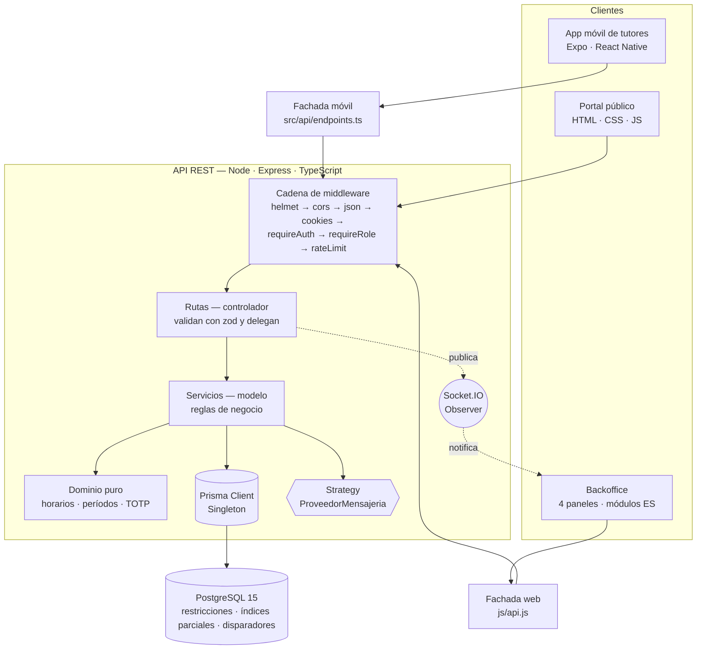
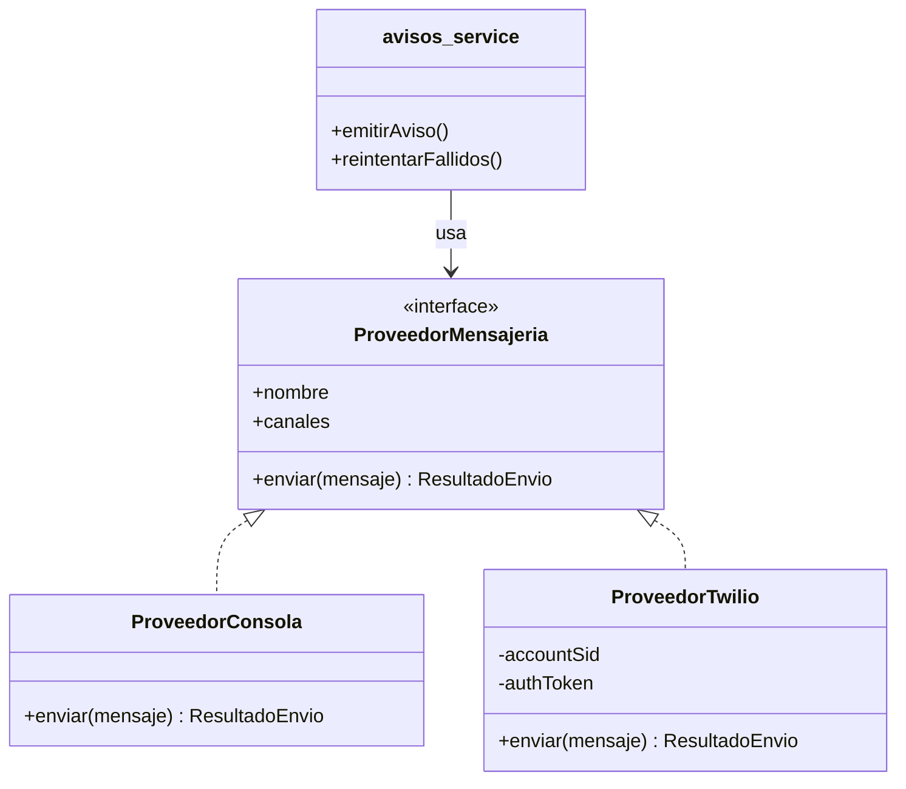
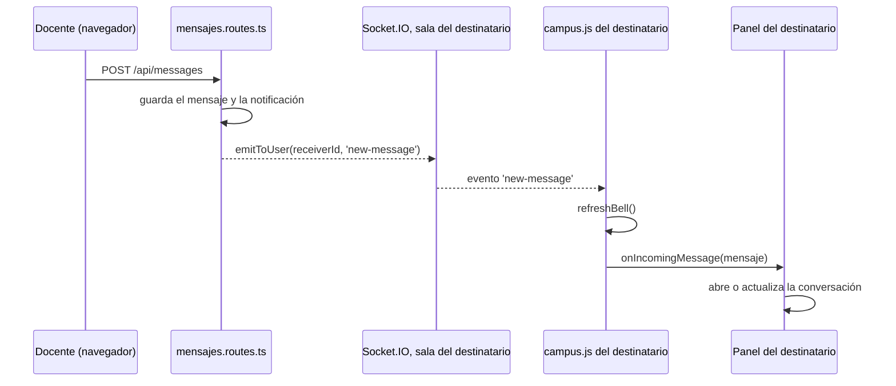

# Patrones de diseño

**Proyecto:** Sistema integral de gestión — Centro Educativo "TRANSFORMAR PARA EDUCAR"
**Materia:** Metodología de Sistemas II — TUP 2026
**Equipo:** Naft — Nahuel Alem · Fabricio Ceniquel Thompson
**Fecha:** 29/09/2026

---

El anteproyecto pide cinco patrones: **Repository, Singleton, Strategy, Observer
y MVC** (ver `docs/plan_de_trabajo.md`, apartado 4.1). Este documento dice dónde
está cada uno en el código, con archivo y línea, y qué problema del sistema
resuelve. También dice cuál **no** está implementado como clases propias
(Repository) y por qué.

Además de los cinco exigidos aparecen otros —cadena de middleware, fachada,
método fábrica, adaptador y plantilla de tarea—, que se resumen en el apartado 7.

Las líneas citadas corresponden a la rama `main` al 29/09/2026. Las rutas son
relativas a la raíz del repositorio.

---

## 1. Mapa general



---

## 2. MVC y arquitectura en capas

El backend es una API: no genera pantallas. MVC se reparte entre el servidor y
los clientes, y dentro del servidor se ordena en tres capas que dependen en un
solo sentido.

| Rol de MVC | Dónde está | Qué hace |
|---|---|---|
| **Vista** | `web/frontend/*.html` y `js/vistas/*.js` · `mobile/src/pantallas/*.tsx` | Muestra y captura. No decide reglas: muestra lo que responde la API, incluidos sus mensajes de error |
| **Controlador** | `web/backend/src/modules/*/*.routes.ts` | Valida la entrada con `zod`, llama al servicio y arma la respuesta |
| **Modelo** | `web/backend/src/modules/*/*.service.ts` · `web/backend/prisma/schema.prisma` | Reglas de negocio y persistencia |

Un controlador típico no tiene lógica propia: valida y delega.
`web/backend/src/modules/alumnos/alumnos.routes.ts:127-136`:

```ts
router.patch('/:id', requireAuth, requireRole(Role.ADMIN), async (req, res, next) => {
  try {
    const { id } = idParam.parse(req.params);
    const alumno = await actualizarAlumno(prisma, id, actualizarSchema.parse(req.body));
    res.json({ exito: true, mensaje: 'Alumno actualizado.', alumno });
  } catch (err) {
    next(err);
  }
});
```

La regla —que al reactivar un alumno haya lugar en su curso— vive en el
servicio (`alumnos.service.ts`), no en la ruta. Por eso la misma regla vale
para el backoffice y para la app móvil, que llaman a la misma API.

**Regla de dependencia.** `rutas → servicios → Prisma → PostgreSQL`. Las reglas
que no necesitan base de datos están en funciones puras, que no importan Express
ni Prisma y se prueban solas: `modules/deportes/horarios.ts` (cruce de
horarios), `modules/facturacion/periodos.ts` (último día hábil, vencimientos) y
`modules/credenciales/totp.ts` (código del carnet).

---

## 3. Strategy — el proveedor de mensajería (RF-07)

**Problema.** RF-07 pide avisar por SMS o WhatsApp a los teléfonos de los padres.
El proveedor comercial (Twilio) requiere un contrato que la institución todavía
no firmó. El sistema tiene que funcionar sin credenciales, y el día que se
contrate un proveedor —ese u otro— no se debería tocar el módulo de avisos.

**Solución.** Una interfaz con una sola operación, `enviar`, y una clase por
proveedor. El módulo de avisos conoce la interfaz, nunca la clase concreta.

`web/backend/src/modules/avisos/proveedores.ts:40-45`:

```ts
export interface ProveedorMensajeria {
  readonly nombre: string;
  /** Canales que sabe manejar. */
  readonly canales: CanalMensaje[];
  enviar(mensaje: MensajeSaliente): Promise<ResultadoEnvio>;
}
```

| Pieza | Dónde |
|---|---|
| Estrategia abstracta | `ProveedorMensajeria` — `proveedores.ts:40-45` |
| Estrategia concreta 1 | `ProveedorConsola` — `proveedores.ts:114-131`. Registra el mensaje en una bandeja en memoria y en el log. Es la que corre sin credenciales |
| Estrategia concreta 2 | `ProveedorTwilio` — `proveedores.ts:142-190`. Envía por la API REST de Twilio |
| Selección | `obtenerProveedor()` — `proveedores.ts:205-224`. Elige según las variables de entorno y, si faltan, cae a la de consola en lugar de fallar |
| Contexto que la usa | `avisos.service.ts`: `emitirAviso` (`:179`) y `reintentarFallidos` (`:313`). Piden `obtenerProveedor()` y llaman a `enviar` sin saber cuál es |
| Inyección para pruebas | `configurarProveedor()` — `proveedores.ts:226-229` |



Cambiar de proveedor es escribir una clase nueva que implemente la interfaz y
sumarla a `obtenerProveedor()`. El módulo de avisos —que resuelve destinatarios,
normaliza teléfonos a E.164 y registra cada envío— no cambia.

**Otro uso del mismo patrón.** El correo elige su transporte al arrancar:
`web/backend/src/services/mailer.ts:15-29` usa SMTP si hay credenciales y, si no,
un transporte que no envía (`streamTransport`). El resto del sistema llama a
`sendMail` igual en los dos casos.

---

## 4. Singleton

**Problema.** Hay recursos que tienen que existir una sola vez por proceso. Un
`PrismaClient` abre un *pool* de conexiones: si cada módulo creara el suyo, la
base se quedaría sin conexiones con pocos usuarios. Lo mismo, en menor medida,
el transporte de correo y el servidor de Socket.IO.

| Instancia única | Dónde | Por qué una sola |
|---|---|---|
| Cliente de base de datos | `web/backend/src/db/prisma.ts:8-16` | Un pool de conexiones por proceso. Se guarda además en `global.__prisma` para que el recargado en caliente de desarrollo no abra un pool nuevo en cada cambio |
| Transporte de correo | `web/backend/src/services/mailer.ts:5` y `:15-29` | Se crea en el primer envío y se reutiliza |
| Servidor de Socket.IO | `web/backend/src/sockets/io.ts:12-15` | `emitToUser` necesita llegar al mismo servidor al que se conectaron los clientes |
| Proveedor de mensajería | `web/backend/src/modules/avisos/proveedores.ts:196` y `:205-206` | Se elige una vez, al primer aviso |

`web/backend/src/db/prisma.ts:8-16`:

```ts
export const prisma =
  global.__prisma ??
  new PrismaClient({
    log: process.env.NODE_ENV === 'production' ? ['error'] : ['error', 'warn'],
  });

if (process.env.NODE_ENV !== 'production') {
  global.__prisma = prisma;
}
```

**Sobre la forma.** No hay una clase con `getInstance()`. En Node un módulo se
evalúa una sola vez por proceso y todos los `import` reciben el mismo objeto: la
instancia a nivel de módulo es la forma idiomática del Singleton en este
lenguaje, con la misma garantía y sin el código extra.

---

## 5. Observer

El patrón aparece en tres lugares. En los tres, quien publica no conoce a quienes
escuchan: sólo avisa que algo pasó.

### 5.1 Mensajería en tiempo real

Cuando alguien envía un mensaje, el destinatario lo ve sin recargar la página.

| Pieza | Dónde |
|---|---|
| Sujeto que publica | `web/backend/src/modules/comunicacion/mensajes.routes.ts:167` — `emitToUser(receiverId, 'new-message', …)` |
| Canal | `web/backend/src/sockets/io.ts:33` (cada conexión se une a la sala `user:<id>`) y `:39-42` (`emitToUser` publica en esa sala) |
| Suscriptor | `web/frontend/campus.js:654-657`, compartido por los cuatro paneles: refresca la campanita y avisa al panel |
| Reacción de cada panel | `window.onIncomingMessage` — `panel_admin.html:447`, `panel_docente.html:405`, `panel_estudiante.html:208`, `panel_padre.html:197` |



La ruta de mensajes no sabe qué panel tiene abierto el destinatario, ni si tiene
alguno: publica en su sala y sigue. Cada panel decide qué hacer con el evento.

### 5.2 App móvil: la sesión que se cae

El cliente HTTP de la app detecta que la sesión venció y no se pudo renovar. Esa
condición le importa a la interfaz —hay que volver a la pantalla de ingreso—,
pero el cliente HTTP no sabe nada de React.

| Pieza | Dónde |
|---|---|
| Registro de oyentes | `mobile/src/api/client.ts:141-149` — `alCaerLaSesion(oyente)` agrega el oyente y devuelve la función para darlo de baja |
| Notificación | `mobile/src/api/client.ts:214` — si el refresco falla, avisa a cada oyente |
| Suscriptor | `mobile/src/auth/SesionContext.tsx:56` — se suscribe al montar y se da de baja al desmontar: `useEffect(() => alCaerLaSesion(() => setUsuario(null)), [])` |

Así no queda una pantalla mostrando datos de una sesión que ya no existe.

### 5.3 Observador del DOM

`web/frontend/campus.js:628` usa `MutationObserver`, la implementación del patrón
que trae el navegador, para que cualquier `<textarea>` que aparezca después de
cargar la página —un formulario que dibuja una vista— crezca con el texto sin
que cada vista tenga que acordarse de activarlo.

> **Próxima extensión.** La revisión de la cátedra pidió que los anuncios y los
> demás eventos se actualicen en tiempo real. Se resuelve extendiendo este mismo
> Observer: un bus de eventos en el servidor que, después de cada escritura
> exitosa, publica "cambió X" en salas por rol, y cada panel vuelve a pedir lo que
> cambió. Este apartado se actualiza cuando esté integrado.

---

## 6. Repository: cómo se cubre y por qué no hay clases propias

**Lo que hay.** El acceso a datos pasa siempre por **Prisma Client**, que genera
a partir de `schema.prisma` un objeto tipado por modelo con las operaciones de
un repositorio: `prisma.alumno.findMany`, `create`, `update`, `count`. Ningún
servicio arma SQL a mano ni abre conexiones propias.

**Lo que no hay.** No hay clases `AlumnoRepositorio`, `ProfesorRepositorio`,
etcétera, escritas por el equipo. El plan de trabajo decía "Repository mediante
Prisma como capa única de acceso"; esto lo precisa.

**Lo que sí se tomó del patrón: la inversión de la dependencia.** Los servicios
no importan la base de datos: la reciben como primer parámetro.

```ts
// web/backend/src/modules/alumnos/alumnos.service.ts:178
export async function crearAlumno(prisma: PrismaClient, input: CrearAlumnoInput) { … }
```

La ruta pasa el Singleton del apartado 4, y las pruebas pasan un doble. La matriz
de autorización —la regla de que un padre sólo ve a sus hijos— se prueba así, sin
base de datos (`web/backend/src/modules/shared/authz.test.ts:4-5` y `:22-40`).

**Por qué no se escribieron clases repositorio:**

1. **Duplicarían la interfaz de Prisma sin agregar reglas.** Un
   `AlumnoRepositorio.buscarPorDni(dni)` sería una línea que llama a
   `prisma.alumno.findUnique({ where: { dni } })`. La capa extra no ocultaría
   nada: Prisma ya es la abstracción sobre la base.
2. **Las operaciones reales cruzan varios modelos en una transacción.** Dar de
   baja a un alumno actualiza sus inscripciones a deportes, transporte y comedor
   y el propio alumno, todo o nada (`darDeBajaAlumno`, `alumnos.service.ts:293`).
   Con un repositorio por entidad haría falta además una *unidad de trabajo* para
   compartir la transacción entre ellos. Prisma la da con `$transaction`.
3. **Las reglas críticas están en el motor, no en la capa de acceso.** El máximo
   de dos deportes, el cruce de horarios y el quinto recorrido los rechaza
   PostgreSQL (índice único parcial, disparadores, restricciones). Una capa de
   repositorios no las haría más seguras.

Si la cátedra pide la forma clásica, el cambio es acotado: una clase por modelo
que envuelve `tx.alumno`, y los servicios la reciben por parámetro igual que hoy
reciben `prisma`.

---

## 7. Otros patrones presentes

| Patrón | Dónde | Qué resuelve |
|---|---|---|
| **Cadena de responsabilidad** (middleware) | `web/backend/src/app.ts:27-74`: compresión, `helmet`, `cors`, JSON, cookies, registro, `/api`, 404 y manejador de errores. En cada ruta: `requireAuth` (`middleware/auth.ts:35`) → `requireRole` (`:52`) → `rateLimit` (`modules/shared/rateLimit.ts:43`) → controlador | Cada eslabón decide si pasa la petición al siguiente (`next()`) o la corta con un error. La autenticación y el rol no se repiten dentro de cada ruta |
| **Fachada** | Web: `web/frontend/js/api.js:134-264`. Móvil: `mobile/src/api/endpoints.ts:209-307` | Las vistas llaman `api.alumnos.listar(filtros)` y no ven `fetch`, el encabezado de autorización, la renovación del token (`api.js:40`) ni la forma de los errores (`api.js:63`) |
| **Método fábrica** | `HttpError.badRequest`, `unauthorized`, `forbidden`, `notFound`, `conflict` — `web/backend/src/utils/httpError.ts:12-35`. `createApp()` — `app.ts:13` | Cada error nace con su código HTTP correcto: no hay un 404 escrito como 400 a mano. `createApp()` arma la misma aplicación para el servidor, las pruebas y el entorno de QA |
| **Adaptador** | `ProveedorTwilio.enviar` — `modules/avisos/proveedores.ts:153-190` | Traduce la API de Twilio —formulario codificado, autenticación Basic, su propio cuerpo de error— a la interfaz `ResultadoEnvio` que espera el sistema |
| **Método plantilla** (tarea idempotente) | `abrirEjecucion` y `cerrarEjecucion` — `modules/scheduler/jobs.ts:59-121`, más `@@unique([tarea, anio, mes])` en `EjecucionTarea` (`schema.prisma:289`) | Las dos tareas programadas (`:147` facturación, `:345` recordatorio) corren dentro del mismo esqueleto: si ya hay una corrida completada para el período, no repiten los correos |
| **Lista blanca de autorización** | `assertPuedeVerAlumno` — `modules/shared/authz.ts:52-79` | Cada rol recibe explícitamente lo que puede ver y un rol no previsto queda afuera. Un padre sin hijos recibe `{ id: { in: [] } }`, nunca un filtro vacío que devolvería todos los alumnos |

---

## 8. Resumen

| Patrón exigido | Estado | Referencia principal |
|---|---|---|
| MVC | ✅ Repartido entre clientes (vista) y API (controlador y modelo), en tres capas | Apartado 2 |
| Strategy | ✅ Proveedor de mensajería intercambiable, y transporte de correo | `modules/avisos/proveedores.ts:40-229` |
| Singleton | ✅ Cliente de base de datos, correo, Socket.IO y proveedor de mensajería | `db/prisma.ts:8-16` |
| Observer | ✅ Mensajería en tiempo real, sesión caída en la app móvil y observador del DOM | `sockets/io.ts`, `mobile/src/api/client.ts:141-149` |
| Repository | ⚠️ Cubierto por Prisma Client e inyección de dependencias, **sin clases repositorio propias**; los motivos están en el apartado 6 | `alumnos.service.ts:178` |
