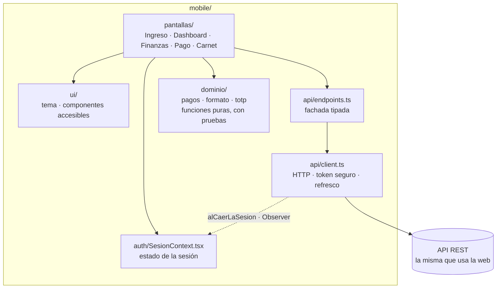
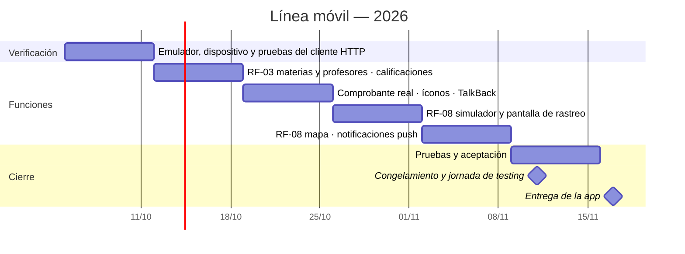

# Plan de Trabajo — Aplicación móvil de tutores

**Proyecto:** Sistema integral de gestión — Centro Educativo "TRANSFORMAR PARA EDUCAR"
**Materia:** Metodología de Sistemas II — Tecnicatura Universitaria en Programación (TUP 2026)
**Equipo:** **Naft** — Nahuel Alem · Fabricio Ceniquel Thompson
**Paquete:** `mobile/` dentro del monorepo pnpm
**Versión de este documento:** 1.0 — 29/09/2026

Este plan detalla la línea móvil del plan general (`docs/plan_de_trabajo.md`). Usa
las mismas fechas, el mismo equipo y la misma Definición de Hecho; lo que agrega
es qué falta construir en la app, en qué orden y cómo se verifica. El detalle
técnico de lo ya construido está en `docs/aplicacion_movil.md`.

---

## 1. Objetivo y alcance

### 1.1 Objetivo

Entregar el **17/11/2026** una aplicación móvil para **tutores** (madres, padres
o responsables) que les permita seguir a sus hijos desde el teléfono: la ficha,
las materias con sus profesores, las cuotas y la deuda, el pago por
transferencia, el carnet digital y el **rastreo del transporte escolar en tiempo
real** (RF-08), sin reimplementar ninguna regla de negocio del backend.

### 1.2 Alcance

| Incluido | Motivo |
|---|---|
| Ingreso sólo para tutores, con recuperación de contraseña | La app es de las familias; un docente o un alumno se deriva al campus web |
| Ficha del hijo, deportes, servicios y asistencia | Es lo que una familia consulta a diario |
| Materias y profesores del hijo | RF-03: los padres consultan los profesores por materia |
| Calificaciones | Completa la ficha académica; el endpoint ya existe |
| Cuotas por estado, deuda por ítem y pago por transferencia con comprobante | Alcance ampliado: facturación y comprobantes |
| Carnet digital con QR dinámico | Alcance ampliado: control de acceso a transporte y comedor |
| Rastreo del transporte | RF-08: pide expresamente hacerlo "desde la aplicación móvil" |
| Notificaciones push | RF-07 y carnet: avisos importantes y accesos, sin abrir la app |

### 1.3 Fuera de alcance

Aplicación para docentes o choferes (el plan general la deja fuera), pago en
línea con tarjeta, modo sin conexión para algo que no sea el carnet, y
publicación en las tiendas de Google y Apple. Para la entrega alcanza un build
instalable o el proyecto abierto con Expo Go.

---

## 2. Requerimientos funcionales

| RF | Qué hace la app | Pantalla | Estado al 29/09 |
|---|---|---|---|
| **RF-03** Acceso de padres | Muestra sólo los hijos vinculados: la app nunca inventa un `alumnoId`, usa los que devuelve `GET /api/padres/mis-hijos`, y el backend verifica el vínculo en cada consulta | Dashboard (selector de hijo) | ✅ Hijos, ficha, deportes con su profesor, servicios y asistencia |
| **RF-03** Profesores por materia | Lista las materias del curso con su profesor. `GET /api/padres/mis-hijos/:id` ya las devuelve (`curso.materias.profesor`) | Sección nueva en Dashboard | ⏳ Pendiente |
| **RF-07** Avisos por mensajería | Los avisos llegan por SMS o WhatsApp desde el backend. La app suma la notificación push | Todas | ⏳ Push pendiente |
| **RF-08** Rastreo del transporte | Estado del recorrido contratado, última posición, hora y distancia al colegio, sobre un mapa y refrescando solo. `GET /api/transporte/seguimiento/:alumnoId` ya valida vínculo, recorrido contratado y franja horaria | Rastreo (nueva) | ⏳ **Backend listo, falta la pantalla** |
| Facturación | Cuotas en tres solapas (pendientes, vencidas, pagadas), detalle con conceptos y comprobantes, deuda por ítem | Finanzas | ✅ |
| Comprobantes | Pago por transferencia: datos bancarios, selector de ítems, foto o PDF del comprobante | Pago por transferencia | ✅ Construido · subida real sin verificar en dispositivo |
| Carnet digital | QR que cambia cada 30 segundos, generado en el teléfono con el secreto guardado en el almacenamiento seguro, y últimos accesos | Carnet | ✅ |
| Calificaciones | Notas por materia e instancia | Calificaciones (nueva) | ⏳ Endpoint tipado en `endpoints.ts:244`, falta la pantalla |

---

## 3. Requerimientos no funcionales

| RNF | Cómo se cumple en la app | Estado |
|---|---|---|
| **RNF-01** Usabilidad | Objetivos táctiles de 48 dp, etiquetas y roles de accesibilidad, mensajes del backend en lenguaje llano, tirar hacia abajo para recargar | Construido · falta probar con TalkBack en un teléfono |
| **RNF-02** Seguridad | Access token en `expo-secure-store` (Keychain / EncryptedSharedPreferences), nunca en AsyncStorage. El refresh token viaja en una cookie `httpOnly` que maneja la capa nativa. Filtro de rol al ingresar | Construido · falta verificar la cookie en Android e iOS |
| **RNF-03** Rendimiento | Pedidos en paralelo con `Promise.allSettled`: si uno falla, el resto de la pantalla se muestra igual | Construido |
| **RNF-05** Compatibilidad | Android e iOS con el mismo código (Expo) | ⏳ **Sin verificar en dispositivo físico** |
| **RNF-09** Datos personales | La app no guarda datos personales ni financieros. La única excepción es el secreto del carnet, en el almacenamiento seguro | Construido |

---

## 4. Stack

Las versiones son las de `mobile/package.json`.

| Elemento | Elección |
|---|---|
| Framework | **Expo SDK 57** (`expo ~57.0.23`) · **React Native 0.86.3** · **React 19.2.3** |
| Lenguaje | TypeScript en modo estricto (`typescript ^6.0.3`) |
| Sesión | `expo-secure-store` |
| Cámara y archivos | `expo-camera`, `expo-image-picker`, `expo-document-picker` |
| QR | `react-native-qrcode-svg` sobre `react-native-svg` |
| Portapapeles | `expo-clipboard` (CBU y alias) |
| Navegación | Estado propio en `App.tsx`, sin React Navigation |
| Pruebas | `node --test` con `tsx`, las mismas herramientas que el backend |
| Por sumar | `expo-notifications` (push) y un componente de mapa para RF-08 |

**Por qué Expo y React Native.** Comparte TypeScript con el backend, así que los
dos integrantes trabajan en cualquier capa sin cambiar de lenguaje. Expo permite
probar en un teléfono real con Expo Go, sin compilar código nativo, y generar un
build instalable para la entrega.

**Por qué sin React Navigation.** Son cinco pantallas con una barra inferior.
React Navigation suma dependencias con código nativo que para este flujo no se
justifican. Si el flujo crece, migrar es un cambio acotado a `App.tsx`.

---

## 5. Arquitectura

**Regla principal: la app no decide reglas de negocio.** El máximo de dos
deportes, el estado de una factura, la deuda por ítem, la acreditación de un pago
y la validez de un código del carnet los resuelve el backend. La app muestra lo
que el backend responde, incluidos sus mensajes de error. Lo único que calcula es
la suma de los ítems elegidos para transferir y el código TOTP del carnet, y las
dos cosas están en `dominio/` con pruebas.

Los patrones que usa están descritos en `docs/patrones_de_diseno.md`: fachada
(`endpoints.ts`) y Observer (`alCaerLaSesion`).

---

## 6. Cronograma

Las semanas son las del plan general. La base de la app —cinco pantallas— ya está
construida, así que el trabajo que queda se reparte en las semanas de los sprints
y termina antes del congelamiento del 11/11.

| Semana | Trabajo | Responsable | Criterio de terminado |
|---|---|---|---|
| **S1** · 05/10 → 11/10 | **Verificación en dispositivo.** Correr la app en un emulador Android y en un teléfono físico contra producción: ingreso, renovación de la sesión por cookie, cierre de sesión y cada pantalla. Pruebas automáticas del cliente HTTP | Ambos | Lista de defectos cargada en Jira; pruebas de `client.ts` en verde |
| **S2** · 12/10 → 18/10 | **RF-03 completo:** materias y profesores del hijo. **Pantalla de calificaciones** | Nahuel | Un tutor ve las materias con su profesor y las notas de su hijo, y no las de otro |
| **S3** · 19/10 → 25/10 | **Subida real del comprobante** desde la cámara, la galería y un PDF (`multipart` de React Native contra `multer`). Íconos y pantalla de inicio. Recorrido con TalkBack | Nahuel · Fabricio (íconos) | Un comprobante subido desde el teléfono aparece en el backoffice para validar |
| **S4** · 26/10 → 01/11 | **RF-08, parte 1:** simulador de posiciones —no hay app de chofer— y pantalla de rastreo con el estado del recorrido, la última posición y la distancia al colegio, refrescando cada 15 segundos | Fabricio | Con el simulador andando, el tutor ve el micro avanzar; fuera de horario ve el aviso correspondiente |
| **S5** · 02/11 → 08/11 | **RF-08, parte 2:** la posición sobre un mapa. **Notificaciones push** para avisos importantes y accesos con el carnet | Fabricio (mapa) · Nahuel (push) | Un aviso emitido desde el backoffice llega como push al teléfono |
| 09/11 → 15/11 | Pruebas y aceptación con la usuaria | Ambos | Casos del apartado 8 ejecutados |
| **11/11** | **Congelamiento y jornada de testing** en dispositivo físico | Ambos | Sin defectos bloqueantes abiertos |
| **17/11** | **Entrega de la aplicación móvil** | Ambos | Build instalable, instrucciones y `docs/aplicacion_movil.md` al día |

**Sobre el simulador de RF-08.** La posición la manda el teléfono que viaja en el
micro (`POST /api/transporte/posicion`, con rol docente o administrador). Esa app
de chofer está fuera de alcance, así que para demostrar el rastreo se escribe un
script que recorre el trazado de un recorrido y publica una posición cada pocos
segundos. Es también lo que permite probar la pantalla sin salir a la calle.

---

## 7. Organización del equipo

Mismo equipo y misma división que el plan general: cada integrante toma las
funciones de sus historias de usuario.

| Integrante | En la app |
|---|---|
| **Nahuel Alem** | RF-03 (materias y profesores), calificaciones, pago por transferencia y notificaciones push (RF-07) |
| **Fabricio Ceniquel Thompson** | RF-08 (simulador, pantalla de rastreo y mapa), carnet digital, íconos e imagen de inicio |

La verificación en dispositivo y la jornada del 11/11 son de los dos. Cada tarea
la revisa el otro integrante antes de cerrarla, como en el resto del proyecto.

---

## 8. Plan de pruebas

| Nivel | Qué cubre | Hoy | Meta al 11/11 |
|---|---|---|---|
| Dominio | Suma de ítems y validación del pago (27), formato de importes y fechas (19), código TOTP del carnet contra `node:crypto` (24) | **70** | 70 + formato del estado de rastreo |
| Cliente HTTP | Reintento con refresco una sola vez aunque fallen tres pedidos juntos, aviso a los oyentes cuando la sesión no se recupera, errores del backend | **0** | Cubierto con un `fetch` simulado |
| Tipos | `tsc --noEmit` contra los tipos reales de React Native y Expo | ✅ | ✅ |
| Manual en dispositivo | Ingreso y rechazo de otros roles · renovación de sesión · cuotas y deuda · subida de comprobante con cámara y PDF · QR leído por el escáner del backoffice · rastreo con el simulador · push · TalkBack | No ejecutado | Ejecutado el 11/11 en un Android físico |

Las pruebas automáticas corren con `pnpm --filter mobile test` y forman parte del
CI del repositorio (`.github/workflows/ci.yml`).

---

## 9. Riesgos y mitigación

| Riesgo | Impacto | Probabilidad | Mitigación |
|---|---|---|---|
| Algo que funciona en los tipos falla en un teléfono real (cámara, `multipart`, cookie de refresco) | Alto | Media | La verificación en dispositivo va primero (S1), no al final |
| Las notificaciones push remotas no funcionan en Expo Go en Android | Medio | Alta | Generar un build de desarrollo con EAS Build para probarlas; el resto de la app sigue probándose en Expo Go |
| El mapa de RF-08 exige una clave de un proveedor de mapas | Medio | Media | Resolverlo en S4: si no hay clave, se usa un mapa abierto (OpenStreetMap) o se muestra estado y distancia sin mapa, que ya cumplen la validación de HU8 |
| No hay un micro real enviando posiciones | Medio | Alta | Simulador de posiciones (S4) |
| El teléfono no llega al backend (URL de la API) | Medio | Baja | `app.json` → `extra.apiUrl` apunta a producción; para desarrollo local se usa la IP de la red |
| Un cambio en una respuesta de la API rompe la app sin que nada avise | Medio | Media | Los tipos de `endpoints.ts` están escritos a mano: un cambio en el backend **no** rompe la compilación de la app. Todo *pull request* que cambie una respuesta que la app usa se revisa contra `endpoints.ts`, y la jornada del 11/11 recorre todas las pantallas |

---

## 10. Entregables

| Entregable | Fecha | Formato |
|---|---|---|
| Este plan | 29/09/2026 | `docs/plan_de_trabajo_mobile.md` |
| Aplicación móvil | 17/11/2026 | Proyecto Expo en `mobile/`, instrucciones de ejecución y build instalable para Android |
| Documentación técnica de la app | 17/11/2026 | `docs/aplicacion_movil.md` actualizado |
| Resultado de la jornada de testing | 11/11/2026 | Casos del apartado 8 con su resultado |

---

## 11. Estado de avance al 29/09/2026

| Elemento | Estado |
|---|---|
| Pantallas | **5** construidas: ingreso, dashboard, finanzas, pago por transferencia y carnet |
| Pruebas automáticas | **70** en verde, todas de dominio |
| Typecheck | ✅ Sin errores |
| Cliente HTTP | Construido, **sin pruebas automáticas** |
| RF-08 rastreo | Backend listo y probado; **falta la pantalla** |
| RF-03 profesores por materia | Backend listo; **falta mostrarlo en la app** |
| Calificaciones | Endpoint tipado; **falta la pantalla** |
| Notificaciones push | No iniciadas |
| Íconos e imagen de inicio | Colores definidos en `app.json`; faltan las imágenes |
| Prueba en emulador o dispositivo físico | **No realizada** |
